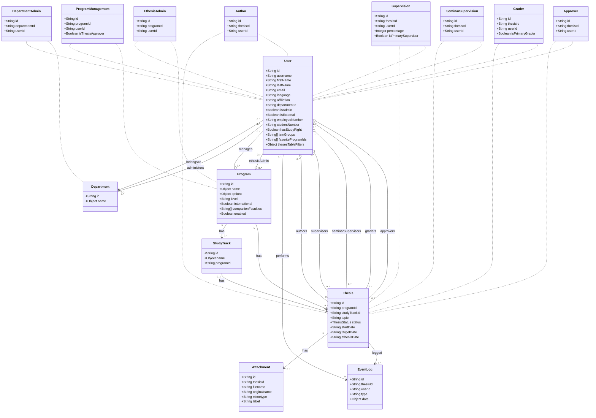

# Database Schema - Grapa (Thesis Management System)

## Overview

This document describes the database schema for the Grapa thesis management system. The database uses PostgreSQL with Sequelize ORM.

## Tables

### 1. users

User accounts in the system.

| Column               | Type          | Constraints                    | Description                    |
| -------------------- | ------------- | ------------------------------ | ------------------------------ |
| id                   | STRING (UUID) | PRIMARY KEY, DEFAULT UUIDV4    | Unique user identifier         |
| username             | STRING        | NOT NULL, UNIQUE               | User's username                |
| first_name           | STRING        |                                | User's first name              |
| last_name            | STRING        |                                | User's last name               |
| email                | STRING        |                                | User's email address           |
| language             | STRING        |                                | Preferred language             |
| affiliation          | STRING        | NULLABLE                       | User's affiliation             |
| department_id        | STRING        | NULLABLE, FK → departments(id) | Reference to user's department |
| is_admin             | BOOLEAN       | NOT NULL, DEFAULT false        | System administrator flag      |
| is_external          | BOOLEAN       | NOT NULL, DEFAULT false        | External user flag             |
| employee_number      | STRING        | NULLABLE                       | Employee number                |
| student_number       | STRING        | NULLABLE                       | Student number                 |
| has_study_right      | BOOLEAN       | NULLABLE                       | Has active study rights        |
| iam_groups           | STRING[]      | DEFAULT []                     | IAM group memberships          |
| favorite_program_ids | STRING[]      | DEFAULT []                     | Favorited program IDs          |
| theses_table_filters | JSONB         | NOT NULL, DEFAULT {...}        | Saved table filter preferences |
| created_at           | TIMESTAMP     | AUTO                           | Record creation timestamp      |
| updated_at           | TIMESTAMP     | AUTO                           | Record update timestamp        |

---

### 2. theses

Thesis records.

| Column         | Type          | Constraints                     | Description                                                 |
| -------------- | ------------- | ------------------------------- | ----------------------------------------------------------- |
| id             | STRING (UUID) | PRIMARY KEY, DEFAULT UUIDV4     | Unique thesis identifier                                    |
| program_id     | STRING        | NOT NULL, FK → programs(id)     | Reference to the program                                    |
| study_track_id | STRING        | NULLABLE, FK → study_tracks(id) | Reference to study track                                    |
| topic          | STRING        | NOT NULL                        | Thesis topic/title                                          |
| status         | ENUM          | NOT NULL                        | Status: 'PLANNING', 'IN_PROGRESS', 'COMPLETED', 'CANCELLED' |
| start_date     | STRING        | NOT NULL                        | Thesis start date                                           |
| target_date    | STRING        | NULLABLE                        | Target completion date                                      |
| ethesis_date   | STRING        | NULLABLE                        | E-thesis submission date                                    |
| created_at     | TIMESTAMP     | AUTO                            | Record creation timestamp                                   |
| updated_at     | TIMESTAMP     | AUTO                            | Record update timestamp                                     |

---

### 3. supervisions

Junction table for thesis supervisors.

| Column                | Type          | Constraints                           | Description                  |
| --------------------- | ------------- | ------------------------------------- | ---------------------------- |
| id                    | STRING (UUID) | PRIMARY KEY, DEFAULT UUIDV4           | Unique supervision record ID |
| thesis_id             | STRING        | NOT NULL, FK → theses(id), CASCADE    | Reference to thesis          |
| user_id               | STRING        | NOT NULL, FK → users(id), CASCADE     | Reference to supervisor      |
| percentage            | INTEGER       | NOT NULL, DEFAULT 100, MIN 0, MAX 100 | Supervision percentage       |
| is_primary_supervisor | BOOLEAN       | NOT NULL, DEFAULT false               | Primary supervisor flag      |
| created_at            | TIMESTAMP     | AUTO                                  | Record creation timestamp    |
| updated_at            | TIMESTAMP     | AUTO                                  | Record update timestamp      |

---

### 4. seminar_supervisions

Junction table for seminar supervisors.

| Column     | Type          | Constraints                        | Description                     |
| ---------- | ------------- | ---------------------------------- | ------------------------------- |
| id         | STRING (UUID) | PRIMARY KEY, DEFAULT UUIDV4        | Unique seminar supervision ID   |
| thesis_id  | STRING        | NOT NULL, FK → theses(id), CASCADE | Reference to thesis             |
| user_id    | STRING        | NOT NULL, FK → users(id), CASCADE  | Reference to seminar supervisor |
| created_at | TIMESTAMP     | AUTO                               | Record creation timestamp       |
| updated_at | TIMESTAMP     | AUTO                               | Record update timestamp         |

---

### 5. authors

Junction table for thesis authors.

| Column     | Type          | Constraints                        | Description                |
| ---------- | ------------- | ---------------------------------- | -------------------------- |
| id         | STRING (UUID) | PRIMARY KEY, DEFAULT UUIDV4        | Unique author record ID    |
| thesis_id  | STRING        | NOT NULL, FK → theses(id), CASCADE | Reference to thesis        |
| user_id    | STRING        | NOT NULL, FK → theses(id), CASCADE | Reference to author (user) |
| created_at | TIMESTAMP     | AUTO                               | Record creation timestamp  |
| updated_at | TIMESTAMP     | AUTO                               | Record update timestamp    |

---

### 6. graders

Junction table for thesis graders.

| Column            | Type          | Constraints                        | Description                |
| ----------------- | ------------- | ---------------------------------- | -------------------------- |
| id                | STRING (UUID) | PRIMARY KEY, DEFAULT UUIDV4        | Unique grader record ID    |
| thesis_id         | STRING        | NOT NULL, FK → theses(id), CASCADE | Reference to thesis        |
| user_id           | STRING        | NOT NULL, FK → theses(id), CASCADE | Reference to grader (user) |
| is_primary_grader | BOOLEAN       | NOT NULL, DEFAULT false            | Primary grader flag        |
| created_at        | TIMESTAMP     | AUTO                               | Record creation timestamp  |
| updated_at        | TIMESTAMP     | AUTO                               | Record update timestamp    |

---

### 7. approvers

Junction table for thesis approvers.

| Column     | Type          | Constraints                        | Description                  |
| ---------- | ------------- | ---------------------------------- | ---------------------------- |
| id         | STRING (UUID) | PRIMARY KEY, DEFAULT UUIDV4        | Unique approver record ID    |
| thesis_id  | STRING        | NOT NULL, FK → theses(id), CASCADE | Reference to thesis          |
| user_id    | STRING        | NOT NULL, FK → theses(id), CASCADE | Reference to approver (user) |
| created_at | TIMESTAMP     | AUTO                               | Record creation timestamp    |
| updated_at | TIMESTAMP     | AUTO                               | Record update timestamp      |

---

### 8. attachments

File attachments associated with theses.

| Column        | Type          | Constraints                        | Description                |
| ------------- | ------------- | ---------------------------------- | -------------------------- |
| id            | STRING (UUID) | PRIMARY KEY, DEFAULT UUIDV4        | Unique attachment ID       |
| thesis_id     | STRING        | NOT NULL, FK → theses(id), CASCADE | Reference to thesis        |
| file_name     | STRING        | NULLABLE                           | Stored filename            |
| original_name | STRING        | NULLABLE                           | Original uploaded filename |
| mime_type     | STRING        | NULLABLE                           | MIME type of the file      |
| label         | STRING        | NULLABLE                           | Attachment label/type      |
| created_at    | TIMESTAMP     | AUTO                               | Record creation timestamp  |
| updated_at    | TIMESTAMP     | AUTO                               | Record update timestamp    |

---

### 9. programs

Academic programs.

| Column              | Type          | Constraints                 | Description                            |
| ------------------- | ------------- | --------------------------- | -------------------------------------- |
| id                  | STRING (UUID) | PRIMARY KEY, DEFAULT UUIDV4 | Unique program ID                      |
| name                | JSONB         | NOT NULL                    | Translated program name {fi, en}       |
| options             | JSONB         | NOT NULL, DEFAULT {}        | Program-specific options               |
| level               | STRING        | NOT NULL                    | Program level (e.g., bachelor, master) |
| international       | BOOLEAN       | NOT NULL                    | International program flag             |
| companion_faculties | STRING[]      | NOT NULL, DEFAULT []        | Associated faculties                   |
| enabled             | BOOLEAN       | NOT NULL, DEFAULT false     | Program enabled status                 |
| created_at          | TIMESTAMP     | AUTO                        | Record creation timestamp              |
| updated_at          | TIMESTAMP     | AUTO                        | Record update timestamp                |

---

### 10. study_tracks

Study tracks within programs.

| Column     | Type          | Constraints                 | Description                    |
| ---------- | ------------- | --------------------------- | ------------------------------ |
| id         | STRING (UUID) | PRIMARY KEY, DEFAULT UUIDV4 | Unique study track ID          |
| name       | JSONB         | NOT NULL                    | Translated track name {fi, en} |
| program_id | STRING        | NOT NULL, FK → programs(id) | Reference to parent program    |
| created_at | TIMESTAMP     | AUTO                        | Record creation timestamp      |
| updated_at | TIMESTAMP     | AUTO                        | Record update timestamp        |

**Indexes:**

- UNIQUE INDEX on (name, program_id)

---

### 11. program_managements

Junction table for program managers.

| Column             | Type          | Constraints                          | Description                 |
| ------------------ | ------------- | ------------------------------------ | --------------------------- |
| id                 | STRING (UUID) | PRIMARY KEY, DEFAULT UUIDV4          | Unique management record ID |
| program_id         | STRING        | NOT NULL, FK → programs(id), CASCADE | Reference to program        |
| user_id            | STRING        | NOT NULL, FK → users(id), CASCADE    | Reference to manager        |
| is_thesis_approver | BOOLEAN       | NOT NULL, DEFAULT false              | Can approve theses          |
| created_at         | TIMESTAMP     | AUTO                                 | Record creation timestamp   |
| updated_at         | TIMESTAMP     | AUTO                                 | Record update timestamp     |

**Indexes:**

- UNIQUE INDEX on (program_id, user_id)

---

### 12. departments

Academic departments.

| Column     | Type          | Constraints                 | Description                         |
| ---------- | ------------- | --------------------------- | ----------------------------------- |
| id         | STRING (UUID) | PRIMARY KEY, DEFAULT UUIDV4 | Unique department ID                |
| name       | JSONB         | NOT NULL                    | Translated department name {fi, en} |
| created_at | TIMESTAMP     | AUTO                        | Record creation timestamp           |
| updated_at | TIMESTAMP     | AUTO                        | Record update timestamp             |

---

### 13. department_admins

Junction table for department administrators.

| Column        | Type          | Constraints                             | Description               |
| ------------- | ------------- | --------------------------------------- | ------------------------- |
| id            | STRING (UUID) | PRIMARY KEY, DEFAULT UUIDV4             | Unique admin record ID    |
| department_id | STRING        | NOT NULL, FK → departments(id), CASCADE | Reference to department   |
| user_id       | STRING        | NOT NULL, FK → users(id), CASCADE       | Reference to admin user   |
| created_at    | TIMESTAMP     | AUTO                                    | Record creation timestamp |
| updated_at    | TIMESTAMP     | AUTO                                    | Record update timestamp   |

**Indexes:**

- UNIQUE INDEX on (department_id, user_id)

---

### 14. event_log

Audit log for system events.

| Column     | Type          | Constraints                         | Description              |
| ---------- | ------------- | ----------------------------------- | ------------------------ |
| id         | STRING (UUID) | PRIMARY KEY, DEFAULT UUIDV4         | Unique event ID          |
| thesis_id  | STRING        | NULLABLE, FK → theses(id), SET NULL | Related thesis (if any)  |
| user_id    | STRING        | NULLABLE, FK → users(id), SET NULL  | User who triggered event |
| type       | STRING        | NULLABLE                            | Event type identifier    |
| data       | JSONB         | NULLABLE                            | Event-specific data      |
| created_at | TIMESTAMP     | AUTO                                | Event timestamp          |
| updated_at | TIMESTAMP     | AUTO                                | Record update timestamp  |

---

### 15. ethesis_admins

E-thesis system administrators.

| Column     | Type          | Constraints                       | Description               |
| ---------- | ------------- | --------------------------------- | ------------------------- |
| id         | STRING (UUID) | PRIMARY KEY, DEFAULT UUIDV4       | Unique record ID          |
| program_id | STRING        | NULLABLE, FK → programs(id)       | Optional program scope    |
| user_id    | STRING        | NOT NULL, FK → users(id), CASCADE | Reference to admin user   |
| created_at | TIMESTAMP     | AUTO                              | Record creation timestamp |
| updated_at | TIMESTAMP     | AUTO                              | Record update timestamp   |

---

## Entity Relationships

## Key Relationships

### User Relationships

- **users** → **departments**: Many-to-one (optional)
- **users** ↔ **theses**: Many-to-many through **supervisions** (thesis supervisors)
- **users** ↔ **theses**: Many-to-many through **seminar_supervisions** (seminar supervisors)
- **users** ↔ **theses**: Many-to-many through **authors** (thesis authors)
- **users** ↔ **theses**: Many-to-many through **graders** (thesis graders)
- **users** ↔ **theses**: Many-to-many through **approvers** (thesis approvers)
- **users** ↔ **programs**: Many-to-many through **program_managements** (program managers)
- **users** ↔ **departments**: Many-to-many through **department_admins** (department admins)
- **users** ↔ **programs**: Many-to-many through **ethesis_admins** (ethesis admins)

### Thesis Relationships

- **theses** → **programs**: Many-to-one (required)
- **theses** → **study_tracks**: Many-to-one (optional)
- **theses** → **attachments**: One-to-many
- **theses** → **event_log**: One-to-many

### Program Relationships

- **programs** → **study_tracks**: One-to-many
- **programs** → **theses**: One-to-many

### Other Relationships

- **departments** → **users**: One-to-many
- **departments** → **department_admins**: One-to-many

## Notes

1. **UUID Primary Keys**: All tables use UUID strings as primary keys with automatic UUIDV4 generation.

2. **Soft Deletes**: The schema uses `onDelete: 'CASCADE'` for most foreign keys, meaning related records are deleted when parent records are removed. The `event_log` table uses `SET NULL` to preserve audit history.

3. **Timestamps**: All tables have automatic `created_at` and `updated_at` timestamps managed by Sequelize.

4. **JSONB Fields**: Several fields use PostgreSQL's JSONB type for flexible data storage:

   - Translated names (departments, programs, study tracks)
   - Program options
   - User table filters
   - Event log data

5. **Array Fields**: PostgreSQL arrays are used for:

   - User IAM groups
   - User favorite program IDs
   - Program companion faculties

6. **Enums**: The `theses.status` field uses an ENUM with values: `'PLANNING'`, `'IN_PROGRESS'`, `'COMPLETED'`, `'CANCELLED'`.

7. **Unique Constraints**:

   - `users.username` is unique
   - `study_tracks` has a unique constraint on `(name, program_id)`
   - `program_managements` has a unique constraint on `(program_id, user_id)`
   - `department_admins` has a unique constraint on `(department_id, user_id)`

8. **Data Model Note**: There appears to be a potential bug in the `authors`, `graders`, and `approvers` models where `userId` references `'theses'` instead of `'users'` in the foreign key definition. This should be verified and corrected if needed.
